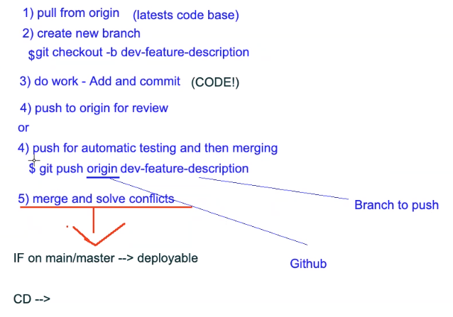

## Branches
- Creating and naming a branch -> `git checkout -b <name of branch>`
- Can also change with `git checkout <name of branch e.g. main>` back to another branch
- Once in the branch, can add files to that branch with `git add .` `git commit -m "message"` and `git push origin <branch name>` 

- **Merging** - Once code has been pushed into your branch, you can do a pull request on github to merge into the main branch
- To make sure that your branch is up to date `git pull origin main` on your branch
