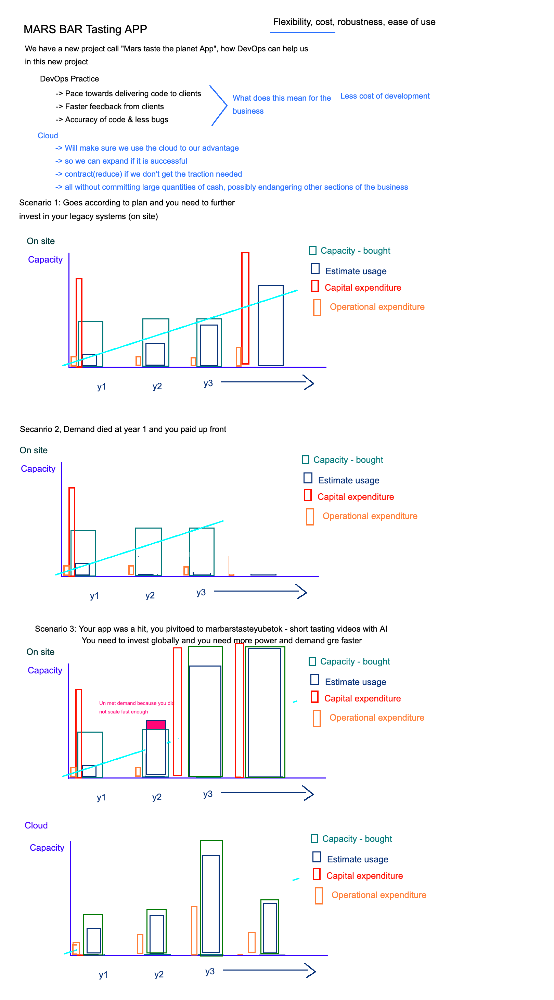
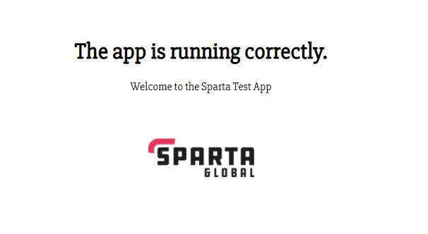

# AWS & Cloud 
## What is the cloud? 
- "The cloud" refers to servers that are accessed over the Internet, and the software and databases that run on those servers. Cloud servers are located in data centers all over the world. By using cloud computing, users and companies don't have to manage physical servers themselves or run software applications on their own machines.
  
- Cloud is typically cheaper now but companies will choose on-prem for other reasons, mainly security concerns
  
- In the past, cloud posed security concerns, but now even governments are switching to private clouds, the UK government for example has invested in G-cloud for government business.
  

## What is AWS?
Amazon Web Services is a cloud computing platform provides an array of cloud services, an infrastructure as a service. We can define AWS (Amazon Web Services) as a secured cloud services platform that offers:
- Compute power
- Database storage
- Content delivery

It allows you to:
- Run servers in the cloud to host dynamic websites
- Store all of your files on the cloud which can be accessed from anywhere
- Use a variety of databases including SQL

## What is EC2?
- A part of AWS cloud platform
- Its primary function is to offer users with the option to rent virtual computers/servers on which they can run their applications. This is achieved via virtualisation of software.
- Users can choose the type of machine they wish to use and then can create a virtual machine (instance) where they can run their programs/software.

## AWS - Creating EC2 instance
- Location -> **Ireland**
- EC2 -> Launch Instance
  
### Step 1: Choose and Amazon Machine Image (AMI)
- Ensure free tier only
- Ubuntu 18.04

### Step 2: Choose Instance type
- Size of machine 
  - Leave as is -> Free tier eligable

### Step 3: Configure Instance Details
- **Network:** DevOpsStudents
- **Subnet:** euwest-1b
- **Enable** Auto-assign Public IP

### Step 4: Add Storage
- Leave as is

### Step 5: Tags
- Add Name -> eng74-matt-app-server

### Step 6: Security Group
- eng74.matt.SG.home
  - HTTP -> Port 80 -> My IP
  - SSH -> Port 22 -> My IP
  - Custom -> Port 3000 -> My IP

### Step 7: Review and Launch
- Use my own AWS key pair generated into the ~/.ssh folder -> eng74mattawskey.pem

## SCP and RSYNC
- Secure copy protocol (SCP) is a means of securely transferring computer files between a local host and a remote host or between two remote hosts. It is based on the Secure Shell (SSH) protocol. **USED IN WINDOWS**
- RSYNC also copies files locally or over a network. But it employs a special delta transfer algorithm and a few optimizations to make the operation a lot faster. Consider the call. - **USED IN UNIX**

## What is a SG? How do you open a port to your ip and to the world?
- A security group acts as a virtual firewall for your instance to control inbound and outbound traffic. When you launch an instance in a VPC, you can assign up to five security groups to the instance. Security groups act at the instance level, not the subnet level. Therefore, each instance in a subnet in your VPC can be assigned to a different set of security groups.
- To open a specific port to your ip or to the world, simply *add* security rules when creating the AWS instance and specify which ports you wish to point to your own IP or to somewhere else

## Why should we not have port 22 open to all ips?
- Port 22 is used for SSH connections which are directly related to your machines security, if someone else had access to your SSH, it would allow them unauthorised access to your machine. This is the reason why you should keep the port accessible only to your IP.
  
## Where do you keep SSH keys?
- All generated SSH keys or key pairs should be stored within the `~/.ssh` directory on your machine
  
## To access VM
- To access the machine, we use SSH as seen below:
  
`ssh -i <AWS generated key pair> ubuntu@<Public IP of Instance on AWS>`

**Example**
- `ssh -i ~/.ssh/emattkey.pem ubuntu@12.14.15.122.23`

## How to send 1 file to remote server
- To send in a file, use SCP (Windows) or RSYNC (UNIX) commands, navigate to the folder where the file is stored and follow the below command line

`scp -i <AWS generated key pair> <filename> ubuntu@<Public IP of Instance on AWS>:<location where the file should be saved in VM>`

**Example**
- `scp -i ~/.ssh/eng74matt.pem provision.sh ubuntu@52.50.1.253:~/provision.sh`

## How to send in multiple files to remote servers?
- To send in multiple files, again use either SCP or RSYNC and follow largely similar command as before but with `-r` added before dir name.

`scp -i <AWS generated key pair> -r <direname> ubuntu@<Public IP of Instance on AWS>:<location where the file should be saved in VM>`

**Example**
- `scp -i ~/.ssh/eng74matt.pem -r app/ ubuntu@52.50.1.253:/home/ubuntu/environment`
  
## General outline of ops to get app running correctly
- First we need to sync all of the app folders from our OS to the VM on AWS. In bash/terminal, navigate to the location with the `app/` and `environment/` folders
1. Sync/copy the `app/` folder into the VM
   `scp -i ~/.ssh/eng74matt.pem -r app/ ubuntu@<Public IP of Instance>:~/`

2. Sync/copy the `environment/` folder into the VM
   `scp -i ~/.ssh/eng74matt.pem -r app/ ubuntu@<Public IP of Instance>:~/`

3. Once all necessary files have been copied into the VM, we can enter the machine with:
   `ssh -i ~/.ssh/emattkey.pem ubuntu@<Public IP of instance>`

4. The `environment/` folder contains `provision.sh` files for the app as well as db which install all necessary programs and run code which starts the app and db. The reverse proxy will have to be changed every time the machine is stopped as public ip changes.
   - To run provision files -> first navigate to `environment/db` and run the `./provision.sh` command to run the provision file and then to the same in the `environment/app` folder in the VM.
   - Now everything should be set up and website should be working:
     - See website working at <Public IP of Instance> in URL of browser
  

# S3 Bucket - Simple Storage Service
- Essentially a blank hard drive
- Used as disaster recovery plans
- Unlimited storage
- Can create a bucket with only `Read` permissions

