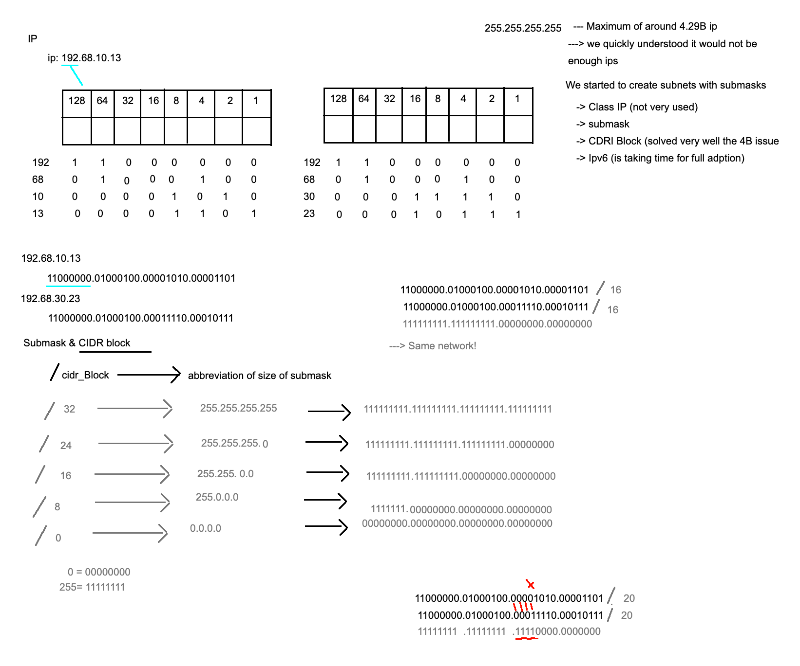
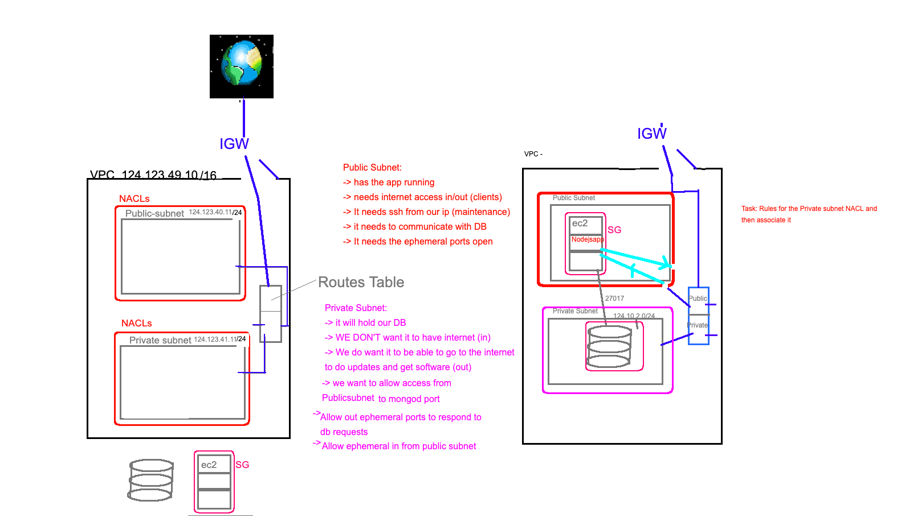

# APIs
- Json & XML
- APIs are services - secret key and user key e.g. email and password for my machine to talk to another machine
- We will do that for our machine to log into aws
- Important thing here is to secure our SSH keys so that they are not easily accessible to unauthorised people

## Networking
- IP calculations

128 64 32 16 8 4 2 1

e.g. **192.68.10.13**

192 -> 128 remainder = 64
64 -> 64 remainder = 0
==== 11000000 ====

68 -> 128 NO
68 -> 64 remainder = 4
4 -> 4 remainder = 0
==== 01000100 ====

10 -> 8 remainder = 2
2 -> 2 remainder = 0 
==== 00001010 ====

13 -> 8 remainder = 5
5 -> 4 remainder = 1
1 -> 1 remainder 0
==== 00001101 ====
- Octets -> 11000000.01000100.00001010.00001101

- Maximum ip: 255.255.255.255 
- This means there is a maxiumum amount of IPs -> 4.29 trillion (or billion?)
  - This means there wont be enough IPs left over for everyone very soon
- This is the reason we started to create subnets with submasks
  - Class IP (not very used)
  - Submask
  - CIDR Block (solved the 4.29 billion/trillion issue)
  - Ipv6 (is taking time to be full adopted by everyone)

## Submask & -> CIDR Blocks (controls submask) <-
- Submask identifes the network and host parts of the IP. Identifies if two networks are in the same network. It does that by identifying if sets of octets are matching to see if they are in the same network. If there is a 1, two networks need to combine
- `/cidr_block` -> abbreviation of size of submask
  - `/32` -> `255.255.255.255` -> `11111111.11111111.11111111.11111111`
  - `/24` -> `255.255.255.0` -> `11111111.11111111.11111111.00000000`
  - `/16` -> `255.255.0.0` -> `11111111.11111111.00000000.00000000`
  - `/8` -> `255.0.0.0` -> `11111111.00000000.00000000.00000000`
  - `/0` -> `0.0.0.0` -> `00000000.00000000.00000000.00000000`

Example IP: **192.68.10.13**
-> `11000000.01000100.00001010.00001101`

Example IP: **192.68.30.23**
-> `11000000.01000100.00011110.00010111`

For `/16` -> `11111111.11111111.00000000.00000000`
-> The above 2 IPs are in the same network! As the first 16 digits of both IPs match perfectly with eachother

For `/20` -> `11111111.11111111.**1111**0000.00000000`
-> The first 16 digits are the same for the but the last 4 digits dont match between the 2 IPs -> So they are NOT on the same network

## N-tier & VPC & AWS -----------> DIAGRAM
- VPC with a specific IP `/16` -> Less secure than the subnets
  - A 2 Tier architecture
  - 1 is a `Public subnet` -> Have its own IP e.g. `124.23.40.11 /24`
  - 2 is a `Private subnet` -> Have its own IP e.g. `124.23.41.11 /24`
    - More secure than the VPC IP -> this means the subnets can communicate as they are on the same network
  - Covering both the Public and Private subnet are Network ACLs! (Access Control Lists) -> Diagram
  - Also need a routes table which connects the different parts together
  - Default route between the private subnet and VPC and others..
  - Also need an `Internet Gateway` to the VPC
    - It will allow access to the internet -> to the routes table
- We also have EC2 instances which we can put into the `Public/Private` subnets if we wish -> These will need Security Groups

***These are essentially the steps/security that we have to pass through to actually access the EC2***

## **PUBLIC SUBNET**
  - Has the app running
  - Needs internet access in/out
  - Needs SSH from our IP (Maintenance)
  - Needs to communicate with DB
  - Needs the ephemeral ports open

## **PRIVATE SUBNET**
  - It will hold our DB
  - WE DON'T want it to have internet (in)
  - WE DO want it to be able to to the internet (out) to do updates and get software
  - We want to allow access from PublicSubnet to mongod port
  - Allow out ephemeral ports to respond to db requests
  - Allow ephemeral in from PublicSubnet

## Creating a VPC --------> REFER TO DIAGRAM
- Go to AWS -> Choose VPC (Virtual Private Cloud) in services 
- Click `Your VPCs` -> V.similar to EC2 -> On the left have all the things we talked about in N-tier above

- `Create VPC`
  - `eng74-matt-vpc`
  - Ipv4 -> `172.10.0.0/16` -> Each VPC should have a different IP
    - For `/16` -> we're only looking at the `172.10` so the rest must be `0`
  - No IPv6 CIDR block
  - Create 
  
- `Internet Gateway` -> on the left
  - Create internet Gateway
  - `eng74-matt-igw`
  - Create
- Click on your IGW -> Actions -> Attach to VPC -> Attach to your vpc
  - Now it should say its `Attached`
  
- Now **Create 2 Subnetworks**
  - `Public` -> Internet Access
  - `Private` -> NO Internet Access
- Click `Subnets` on the left
  - **Create subnet -> PUBLIC** 
  - Select your VPC
  - Name -> Public first `eng74-matt-subnet-public`
  - Availability zone -> `No Preference`
  - IPv4 -> IP: `172.10.1.0/24`
  - **Below Create another Subnet -> PRIVATE**
  - `eng74-matt-subnet-private`
  - IPv4 -> IP: `172.10.2.0/24`

- **Route Table**?? -> By default, it already exists -> See under the subnets details
  - Click on the route table -> Check routes and subnet associations
  - Route -> It can go to VPC IP: `172.10.0.0/16`
  - Subnet Associations -> NONE, BUT by default the subnets we created get associated with it
  - NAME your Route table -> `eng74-matt-route-private`
  - **Create ANOTHER route table BLUE BUTTON**
  - Name tag -> `eng74-matt-route-public`
  - VPC -> Choose your VPC
  - Create it
  - Associate public route to public subnet AND to IGW
  - Edit routes -> Add routes
    - Target = your igw
    - Destination = `0.0.0.0/0` -> PUBLIC
  - Subnet Associations -> Edit subnets -> SELECT public subnet
    - ***Now public route is connected to both IGW and the PUBLIC subnet***

- Add in **ACLs** -> Network ACLs under Security  -> Create new network ACL
  - **PUBLIC**
  - Name -> `eng74-matt-nacl-public`
  - Choose your vpc
  - Select it -> Change rules as they are denied by default
    - Edit **Inbound rules** -> Add rule THINK ABOUT IT, ITS PUBLIC, WHAT IS ALLOWED??
      - Port 80: Rule # = `100` HTTP 80 -> Source `0.0.0.0/0`
      - Port 443: `110` HTTPS -> Source `0.0.0.0/0`
      - Port 22: (SSH) `120` -> Source MY IP (Can take it from the EC2 instance SG) `ipchicken.com` to check ip
      - Port 1024-65535: Custom `140` -> Source `0.0.0.0/0`
        - This has access to port 3000: due to the nature of this 'Thermal Port'. These are used extensively
    - Edit **Outbound Rules** -> THINK ABOUT IT AGAIN
      - Port 80: HTTP `100` -> `0.0.0.0/0`
      - Port 22: SSH `110` -> `0.0.0.0/0`
      - Port 1024-65535: Custom `120` -> `0.0.0.0/0`
      - We want to explicitly connect to the PRIVATE subnet 
        - Port 27017 `130` -> `172.10.2.0/24`
    - Subnet Associations -> Associate with PUBLIC
  - **PRIVATE**
    - Do all of the major ports going to and from public subnet (inbound outbound) 

- Now can create the EC2 instance `eng74-matt-app-in-vpc`
  - This instance will have the App installed on it
  - SSH in and install the app
- Then create the EC2 instance for db `eng74-matt-db-in-vpc`
  - SSH in and install the db and start it
  - For this we had to open all ports to the world on most of the security layers

