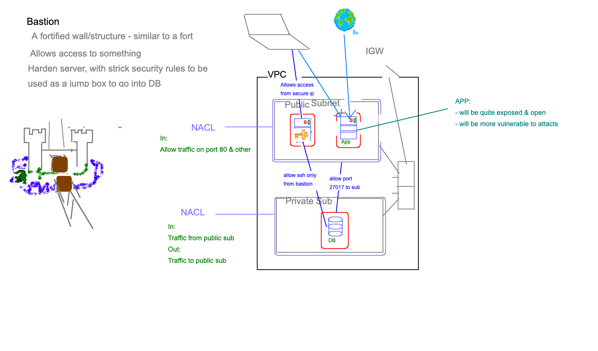

# Bastion
- Fortified instance that allows access to something.
- A hardened server with strick security rules
- We use it as a VERY secure go-between to access the db instance with the db.
- You just use it to SSH in and access/modify db from a secure ip

## Bastion Creation
Create bastion EC2 in PUBLIC subnet
Only SG -> 22 -> my ip

Send in aws key `eng74mattaws...` to bastion server `~/.ssh`

SG for db instance ->
ssh -> allow only bastion i.e. SG-Bastion
27017 -> everywhere

outbound
everywhere

now just ssh into bastion -> and from bastion VM ssh into DB and you are only allowed to ssh into db from bastion. Bastion already has the aws key which you copied in earlier

now everything should be connected and the only change is we need to specify the DB_HOST=private ip of db instance (cant use public ip as we are doing this internally within the VPC)

Assessment -> VPC, CI CD, Networking, bastion

## Network ACL Rules & Routes
**Public**
Route:
- To VPC
- 0.0.0.0/0 to igw
Associated to public subnet

ACL:
Inbound:
- Port 80 -> 0.0.0.0/0
- Port 22 -> My IP
- Port 1024-65535 -> 0.0.0.0/0

Outbound:
- Port 80 -> 0.0.0.0/0 **Updates**
- 1024-65535 -> 0.0.0.0/0 **Updates**
- 27017 -> Private IP Subnet
- 22 -> Private IP Subnet

**Private**
Route:
- To VPC
Associated to private subnet

ACL:
Inbound:
- Port 22 -> Public_subnet
- Port 27017 -> Public_subnet
- 1024-65535 -> 0.0.0.0/0

Outbound:
- Port 80 -> Public Subnet
- 1024-65535 -> Public Subnet