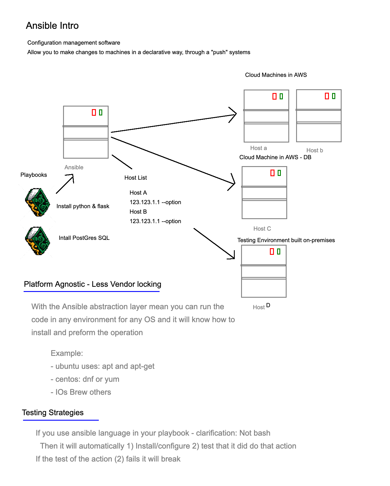

# IAC - Infrastructure as code
- Writing infrastructure as code/declaring infrastructure and then have the ability to have it build or created. It can create Machines, Environment or architecture.
- Two categories of tools: Configuration Management & Orcheastration

## Configuration Management Tools
They help configure and test machines to a specific state. They also help with the maintaining of the system:
- Puppet
- Chef
- Ansible (Push Configuration Management)

They have a Controller Agent/Host Relationship

They mainly help **provision**:
- Install packages
- Config files
- Send in files
- Environment Variables
- Start and enable services

## Orcheastration
- Once we have a machine image, orcheastration tools are used to deploy these into more complex environments. 
- These tools focus on networking and architecture rather than the configuration of individual machines. 
- They focus more on the environment where these machines run. 
  - Terraform
  - Ansible
  - CloudFormation

## Ansible
**Definition**
- An open-source automation tool for configuration management
- Allows you to make changes to machines in a declarative way through "push" systems
- Uses 'Playbooks' to install packages and programs like python and sql onto ansible.

**Platform Agnostic**
- With the Ansible abstraction layer mean you can run the code in any environment for any OS and it will know how to install and perform the operation.
- Example:
  - Ubuntu uses: apt and apt-get
  - Centos: dnf or yum
  - IOs Brew others

**Testing Strategies**
If you use ansible language in your playbook - clarification: Not bash
Then it will automatically:
1. Install/configure
2. Test that it did do that action -> If the test of the action fails, it will break

## EC2 with Ansible
Create an instance
On DevOps students vpc
-> under configure instance details -> Protect against accidental termination
NEW SG for ansible 
    SSH to my IP
    80 to my IP
    3000 to my IP